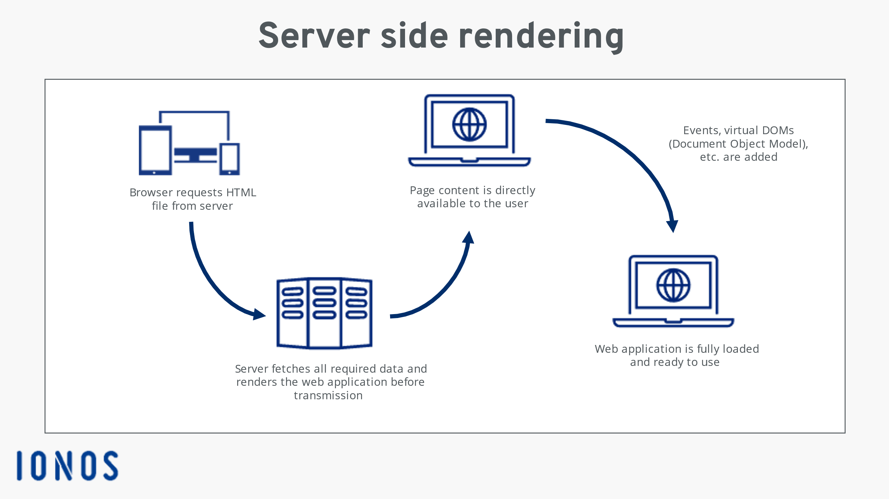
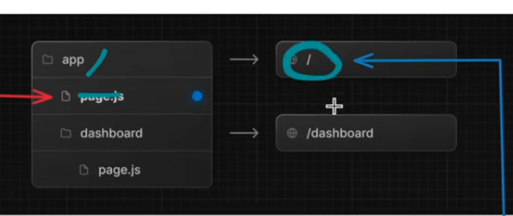
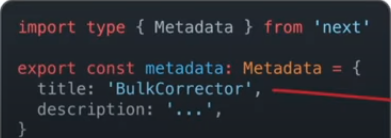

# Next.js

Next.js is a powerful React-based, open-source framework designed to simplify web application development. It supports multiple rendering methods (static, client-side, or server-side) on a per-page basis, allowing for fast, adaptable performance for both static and dynamic content. With features like image optimization, API routes, and file streaming, Next.js provides a seamless development experience for building scalable, multi-page applications. It is maintained by Vercel.

## Key Features

| Feature                    | **Next.js**                                      |
| -------------------------- | ------------------------------------------------ |
| **Framework**               | React (with SSR/SSG support)                    |
| **Language**                | TypeScript                                      |
| **Performance**             | Optimized for SSR and SSG                       |
| **SEO**                     | Built-in SEO optimization                       |
| **Support and Maintenance** | Actively maintained by Vercel                   |

---

# Comparative Study between **Next.js**, **Angular**, and **Vue.js**

### Introduction

This section compares **Next.js** with other popular JavaScript frameworks: **Angular** and **Vue.js**.

- **Next.js** is a React-based framework designed to excel in SEO and performance, with strong support for SSR (Server-Side Rendering) and SSG (Static Site Generation).
- **Angular**, developed by Google, is a TypeScript-based framework ideal for building complex, large-scale applications with structured architectures.
- **Vue.js** is a progressive framework known for its ease of use and flexibility, making it ideal for projects of all sizes.

### Comparison Table

| Criteria                       | **Next.js**                                  | **Angular**                                                        | **Vue.js**                                                    |
| ------------------------------ | -------------------------------------------- | ------------------------------------------------------------------ | ------------------------------------------------------------- |
| **Ease of Learning**           | Easy for React developers                     | Steeper learning curve due to TypeScript and Angular's complexity  | Easy to learn, ideal for JavaScript developers                |
| **Architecture & Flexibility** | Highly flexible (SSG, SSR, hybrid options)   | Structured, opinionated framework                                  | Flexible, scales well from simple to complex applications     |
| **Performance & SEO**          | SEO-optimized with SSR and SSG               | SEO possible but requires additional configuration (Angular Universal) | SEO-friendly with proper setup (e.g., vue-meta)               |
| **Ecosystem & Tools**          | Part of the React ecosystem                  | Large, established ecosystem with powerful tools (e.g., Angular CLI) | Rich ecosystem, focused on simplicity and flexibility         |
| **Developer Experience**       | Smooth and efficient, simple deployment      | Robust but more complex due to architecture                        | Clear documentation, easy to set up and use                   |
| **Scalability & Maintenance**  | Great scalability with SSR/SSG               | Excellent for large-scale, enterprise-level applications           | Scales well for both small and large applications             |
| **Community & Documentation**  | Fast-growing community, modern documentation | Established community with comprehensive support                   | Strong community, excellent documentation                     |

---

### Code Examples

Let’s compare how a simple "Hello World" is written in each framework:

#### **Angular**

```typescript
import { Component } from "@angular/core";

@Component({
  selector: "app-root",
  template: `<h1>{{ title }}</h1>`,
})
export class AppComponent {
  title = "Hello World!";
}
```

#### **Next.js**

```typescript
export default function Home() {
  return <h1>Hello World!</h1>;
}
```

#### **Vue.js**

```typescript
<template>
  <h1>{{ title }}</h1>
</template>

<script>
export default {
  data() {
    return {
      title: 'Hello World!',
    };
  },
};
</script>
```

---

### Conclusion of Comparative Study

- **Next.js**: Ideal for projects requiring strong performance and SEO, especially content-heavy sites like blogs and e-commerce platforms. Next.js is highly flexible and offers a great developer experience, making it an excellent choice for modern web applications.
- **Angular**: Best for large-scale applications, especially enterprise solutions that require robust architecture and full TypeScript support. Its steep learning curve is offset by its powerful ecosystem.
- **Vue.js**: A perfect middle ground for developers looking for simplicity and flexibility. Vue is ideal for small to medium-sized applications but can scale effectively when needed.

---

## SSR (Server-Side Rendering)

Server-Side Rendering (SSR) transforms React code into HTML on the server before sending it to the user, improving SEO and performance. This process allows for faster page loads and better search engine optimization.



## SSG (Static Site Generation)

With Static Site Generation (SSG), pages are built during the build process (when committing the code to the server). The server generates static HTML, which is then served to the user, improving load times.

---

## Next.js App Structure

- **app/**: The main directory containing your components and pages.
- **Server Components**: React components that run server-side logic.
- **Server Actions**: Functions that handle server-side actions like API calls or database operations.
  
### Routing in Next.js

Routing is automatic with file-based routing. For example, `page.js` corresponds to the route `"/"`, and `page.js` in the `dashboard` directory corresponds to `"/dashboard"`.



---

## Layout and File-Based Routing

- **layout.js**: This file wraps around your child components. Any styling or layout-related code here will be applied to its children.
- **Routing**: Only `page.js` (or `ts`) files are considered routable, while `nav.js` files do not directly correspond to routes.

---

## API Routes

Next.js allows you to define API routes within the application. You can export functions (like `GET`, `POST`, `PATCH`, `DELETE`) which are mapped to the corresponding HTTP methods.


---

## SEO Optimization

Next.js provides built-in features for SEO optimization, including OpenGraph and Twitter Card image support. You can define metadata for your pages to improve search engine visibility.



---

## Fetching SSR Data

To fetch SSR data, simply use an async method in your React components. The server fetches the data, transforms it into HTML, and sends it to the user.

---

## Client-Side Interactivity

You can add interactivity with React by marking components with `"use client"`. This allows JavaScript to be used on the client side to handle events such as `onClick()` after the HTML is delivered.

---

## Why Choose Next.js?

**Final Decision**: We chose Next.js for its simplicity, flexibility, and powerful server-side rendering capabilities. Even though SEO is not our primary focus, it is a valuable feature, and Next.js’ seamless integration with React ensures that we remain on the cutting edge of modern web development. With its growing community and continual improvements, Next.js is an excellent choice for our project.

---

## Sources

1. YouTube Video Explanation: [Watch here](https://www.youtube.com/watch?v=Q5W5FYFzcEk&t=4s)
2. [Next.js Documentation](https://nextjs.org/)
3. [Ionos: Server-Side vs Client-Side Scripting](https://www.ionos.ca/digitalguide/websites/web-development/server-side-and-client-side-scripting-the-differences/)
4. [Angular Documentation](https://angular.dev/overview)
5. [Medium Article: Angular vs Next.js](https://medium.com/@nirantharika5/angular-vs-next-js-choosing-the-right-framework-for-your-web-development-project-e7029420bc2c)
6. [DEV Article: Angular vs Next.js Debate](https://dev.to/angel_afube/exploring-the-angular-vs-nextjs-debate-3ab9)
7. [DEV Article: Choosing Between Next and Vue](https://medium.com/@1032210476/choosing-between-next-js-and-vue-js-467abdd85b18)

